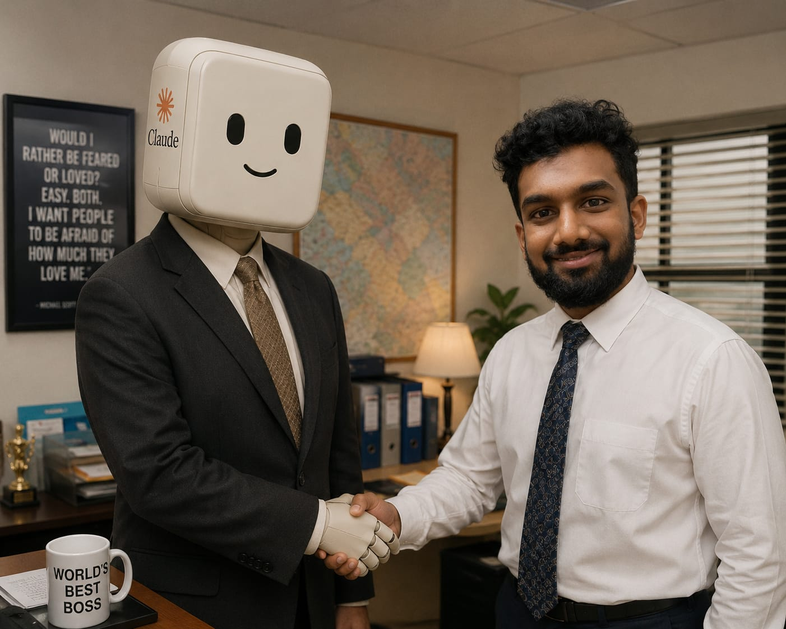

<div align="center">



# 👋 Hi, I'm Rishu Gudigar

### *Assistant to the Software Engineer*

> “Would I rather be feared or loved? Easy. Both. I want people to be afraid of how much they love me.”
>
> — Michael Scott


<p>

<a href="mailto:rishu.gudigar@gmail.com">

</a>

<a href="https://linkedin.com/in/rishu-rg">

</a>

<a href="https://github.com/rishugudigar">

</a>

</p>

</div>

---

## 🗂 Pam bring my personel file

```yaml
Name: Rishu Gudigar

Location:
  Bengaluru, India

Occupation:
  Software Development Engineer @ Amadeus

Specialization:
  - Python Scripting
  - AI Agent Orchestraction

Current Mission:
  Wait for Ai bubble to burst again to write code again.
  Go to gym and have abs

Current Obsession:
  Agentic AI
  Orange tabby
  My cat
  AI which can clean AI Shit

Coffee:
  Required ☕

Threat Level:
  Midnight
```

---

## 🖥 Things I understand with help of Chatgpt Claude and Copilot

### Languages

<p>

</p>

### Frameworks

<p>

</p>

### Cloud & DevOps

<p>

</p>

### Databases

<p>

</p>


## 💼 Work Experience in Reality
> “And I knew exactly what to do. But in a much more real sense, I had no idea what to do.”

## 💼Things I did for money
### 🏢 Amadeus Software Labs

**Software Development Engineer**

> Built AI-powered localization systems serving enterprise-scale products.

* 🤖 Agentic AI workflows
* ☁️ Kubernetes & OpenShift
* ⚡ Airflow Pipelines
* 🚀 ArgoCD
* 💻 React + TypeScript
* 🌍 GCP

---

### 🔒 Security Engineering Intern

Built an internal Threat Modeling Platform used during Secure Development Lifecycle.

---

### 🌐 Web Development Intern

Worked on authentication, dashboards and analytics.

---

## 📂 What I built because I am a Software Engineer

### 🧠 PharmSearch

Medical knowledge search powered by RAG.

> Processed an entire pharmacology textbook into structured embeddings for semantic search and conversational Q&A.

**Tech**

Python • LangChain • Pinecone • OpenAI • Pandas

---

### 📄 GST Biller

Offline Flutter invoicing application.

Features

* GST Calculation
* SQLite Database
* PDF Generation
* Dashboard Analytics
* Product Management

---


---

## 📈 Daily Report

<div align="center">


</div>

<br>

<div align="center">


</div>

---

## 🏆 Certifications

* Docker Essentials & Containerized Web Applications
* Monitoring Kubernetes with Prometheus & Grafana

---

## ☕ Current Status

```text
☕ Coffee:        ██████████ 100%

🐛 Bugs Fixed:    ███████░░░ 70%

✨ Bugs Created:  ██████████ 100%

🧠 AI Ideas:      ██████████ ∞

😴 Sleep:         ██░░░░░░░░ 20%
```

---

## 📫 Let's Connect

📧 **[rishu.gudigar@gmail.com](mailto:rishu.gudigar@gmail.com)**

💼 **LinkedIn**
https://linkedin.com/in/rishu-rg

💻 **GitHub**
https://github.com/rishugudigar

💻 **Instagram**
https://www.instagram.com/rishugudigar

💻 **Leetcode**
https://leetcode.com/u/user9562Ig/

---

<div align="center">

> **"I'm not superstitious... but I am a little stitious."**
> — Michael Scott

<sub>If something here inspires you, feel free to ⭐ a repository or connect!</sub>


</div>


Currently Learning:
  - Advanced System Design
  - Machine Learning
  - LLM Infrastructure
```

